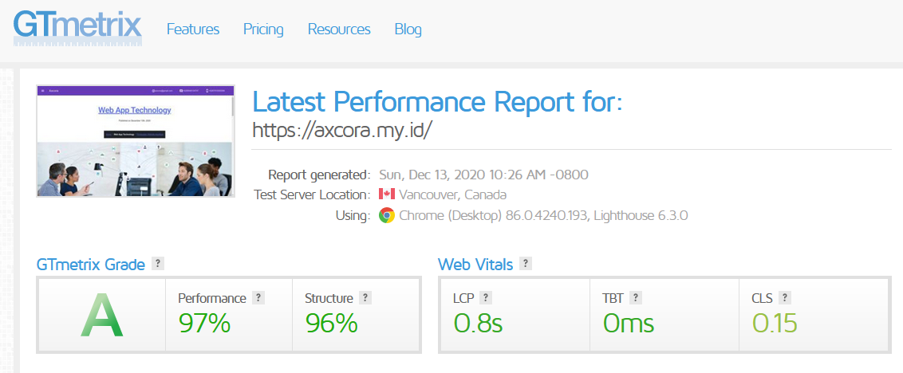

# New Modern CMS Build a website without database.

A new generation get simpe cms axcora tech for develope website project powerfull !!

No need a database for installation , make your website very fast and SEO friendly.

Template restaurant my resto for get axcora cms.

Login Area for backend

Page and article post menu.

Create article post very simple and easy

File manager system

Back end setting

Test Speed using [company profile themes](https://github.com/mesinkasir/companyprofilwebsite-getaxcoracms)

 -----------------------------------------------------------------
### how to install

CLOUDS / SHARED HOSTING

Just download this file and upload on your shared or clouds host , upload on public_html fle if you using this cms for develope home page website, or you can upload it on sub directori .
After upload progress success, now you need to configure just login on backend yourwebsite/admin and go to setting menu, then change webite url, and save
Your website is online now .

LOCALHOST
Need third party XAMPP WAMPP LAMPP server, download this project and upload on your xampp/htdocs folder, now you need to configure just login on backend yourwebsite/admin and go to setting menu, then change webite url with localhost/projectfolder

By default use username : axcora and password : axcoracms

Features :
+ Page for create new post article content you can edit and delete too.
+ File menu for upload media manager
+ Setting for change password and others.
+ SEO : automaticly generate meta title , description , facebook, twitter.

No need a database installation make your website very fast, and of course with SEO friendly include, simple and easy to use.

[Video Demo →](https://www.youtube.com/watch?v=vqbeeSLq-Fo)

Live test speed and demo website using company profile themes
https://axcora.my.id

more info https://axcora.com/getaxcoracms

present by https://axcora.com

Hapy codding !!
